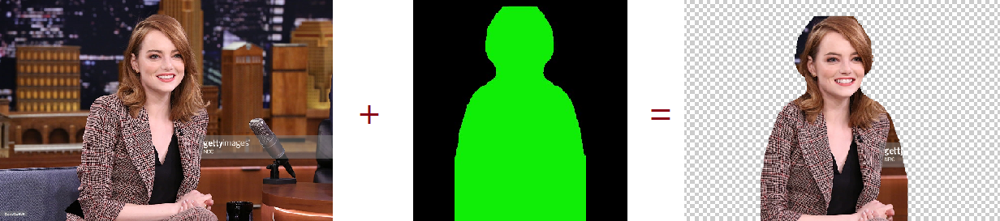
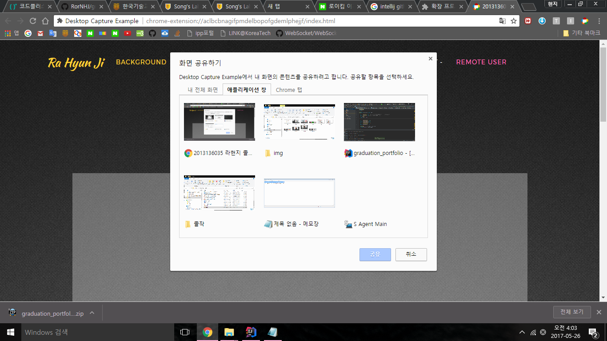
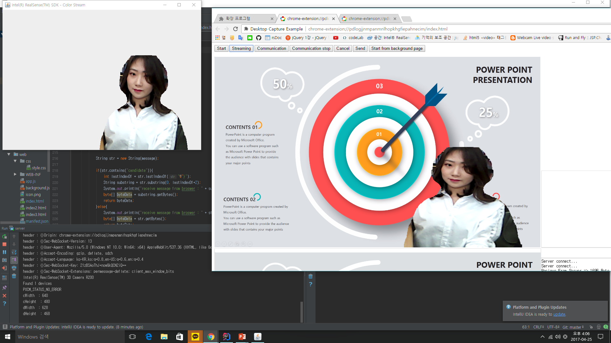
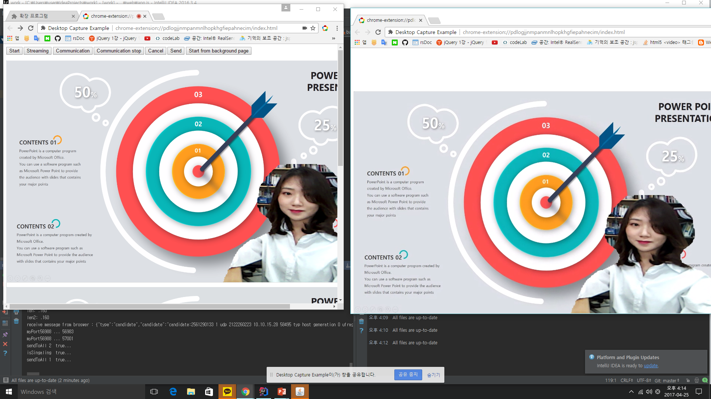

this is my graduation_portfolio
It is image processing using intel 3d camera and video conference using webRTC.

Use the camera's face tracking feature to put the person template on the face and separate the background and the person.
The server sends a separate person's image to the browser using a web socket.
The client composes the image received from the server with the shared screen using the chrome's shared screen selection function.
Start real-time video conferencing using webRTC to the other side of the synthesized screen.

1.프로젝트 개요 
인텔의 3d카메라 html5의 webRTC를 사용한 클라이언트 끼리의 화상 프레젠테이션 웹서비스입니다.서버에서 3d카메라를 이용하여 사람의 모습과 뒷배경을 분리해내고, 이를 클라이언트에게 넘겨줍니다. 클라이언트는 웹브라우저에서 분리해낸 사람의 모습과 합성할 배경(ppt,웹사이트,크롬탭,메모장,그림판과 같은 프로그램)등을 선택하고 이를 다른 클라이언트에게 실시간으로 전송합니다.  

2.프로젝트 구체적 기능 
서로 화상통신을 하고자 하는 두 클라이언트(발표자, 시청자)서버에서는 3d카메라로 발표자의 모습을 촬영하고 사람의 모습과 배경을 분리해냅니다. 이 때 사용한 기능은 3d카메라의 얼굴인식 기능이며 얼굴 크기에 따라 사람 모양의 템플릿 크기를 계산하여 덮어씌우고, 씌워지지 않은 나머지 부분을 삭제합니다. 이렇게 분리해낸 사람의 모습을 웹브라우저(발표자)에게 보냅니다(webSocket). 발표자는 서버에게서 받은 자신의 분리된 모습과 합성할 배경을 선택합니다. 이 때의 배경은  특정 웹사이트, ppt, 메모장이나 그림판같은 응용프로그램들, 크롬 탭 등 다양하게 선택할 수 있습니다. 배경 선택기능은 구글 크롬에서 제공하는 기능이며, 소스코드를 오픈소스로 제공하고 있기 때문에 참고하여 구현하였습니다. 
선택되어진 배경과 분리된 자신의 모습을 합성하면 하나의 비디오 스트림이 만들어집니다. 이 비디오 스트림에 webRTC의 오디오 스트림 생성 기능을 이용하여 마이크로부터 발표자의 목소리를 비디오 스트림과 합성하여 상대방(시청자) 클라이언트에게 webRTC 기능을 사용하여 보냅니다. 

3.시그널링 서버 
webRTC는 시그널링 서버를 구현하여 이 서버를 통해 서로 통신하고자 하는 두 클라이언트 들의 정보를 서로 교환하면 서버의 지속적인 연결 없이도, 서버가 다운되더라도 두 클라이언트들은 지속적으로 실시간 통신을 할 수 있습니다. 
두 클라이언트가 서로 교환해야할 정보는 sdp(메타정보: 송수신하고자 하는 데이터 코덱,포맷 등), ICE candidate(네트워크 연결정보) 이 두가지 입니다. 이 두가지를 서버를 통해서 클라이언트들끼리 서로 주고받으면 그때부터 udp통신을 할 수 있습니다. 저는 이 시그널링 서버를 java로 구현하였습니다. 

4.구글 크롬의 배경선택 기능 
구글 크롬에서는 오픈소스로 배경 선택기능을 제공합니다. 저는 이 소스코드를 참고하여 클라이언트 단에서 자신이 원하는 배경을 선택할 수 있도록 해당 api를 적용하였습니다..  

5.영상처리 부분 
영상 부분에서는 저는  인텔의 3d카메라로 이용하여 사람과 배경을 분리하였습니다. 3d카메라의 얼굴 추적 기능을 이용하여 얼굴을 추적하고, 얼굴 크기에 따라 미리 준비해놓은 사람모양의 탬플릿을 덮어씌워서 씌워지지 않는 부분을 배경으로 인식하고 제거하여 분리했습니다. 얼굴인식기능은 인텔사에서 제공하는 소스코드를 적용하였고, 분리해내는 부분을 템플릿의 색상을 이용하여 크로마키 기법을 분리했습니다.
 
  

사람과 배경 분리 과정
   

구글 크롬의 배경 선택 기능
   

서버와 클라이언트의 통신(webSocket)

   

클라이언트와 클라이언트끼리의 통신 (webRTC)
